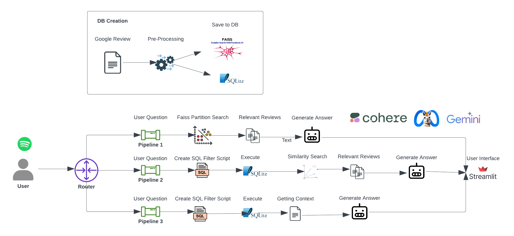

<p align="center">
  
</p>

# Spotify User Insight Chatbot

An internal Q&A chatbot designed to help Spotify’s management gain actionable insights from vast amounts of Google app reviews. This tool efficiently processes unstructured review data by dynamically routing user questions through specialized pipelines that leverage advanced language models and vector-based search.

## Table of Contents
- [Overview](#overview)
- [Chatbot Architecture](#chatbot-architecture)
  - [Direct Answer Pipeline](#1-direct-answer-pipeline)
  - [Filter Pipeline](#2-filter-pipeline)
  - [Aggregate Pipeline](#3-aggregate-pipeline)
- [Tech Stack](#tech-stack)
- [Setup](#setup)
- [Usage](#usage)
- [Contributing](#contributing)
- [License](#license)

## Overview

This chatbot is designed to handle complex questions about Spotify app reviews by routing them through different processing pipelines. It leverages three language models (LLMs) to optimize response quality and efficiency:
- **Gemini Flash** (15 requests per minute)
- **Cohere** (20 requests per minute)
- **LLaMA 3.2** (runs locally using the Ollama framework)

Gemini and Cohere are accessed via API for quick inference, while LLaMA 3.2, a more lightweight model, acts as a fallback when API limits are reached.

## Chatbot Architecture

User questions are processed through a `qa_router_pipeline` that directs queries to one of three specialized branches: **Direct Answer**, **Filter**, or **Aggregate**.



### 1. Direct Answer Pipeline
This pipeline handles questions that can be answered directly by the LLM without additional filtering or aggregation. For example:
- **Example Question**: "Which music streaming platform do users compare ours with the most?"

   - The question is embedded using Sentence-BERT.
   - FAISS vector indexing (using the `IndexIVFFlat` partitioning) retrieves relevant review clusters (e.g., competitor-related clusters) to speed up the search process.
   - The LLM then processes the user question along with the clustered context to generate an answer.

### 2. Filter Pipeline
This pipeline is triggered when a question requires filtering review data before similarity matching. For instance:
- **Example Question**: "What are the primary reasons users express dissatisfaction with Spotify?"

   - Reviews are filtered based on criteria like ratings below 3.
   - The LLM generates a SQL query (e.g., `SELECT review_id FROM user_review_table WHERE rating < 3;`) to select relevant reviews.
   - If SQL syntax errors occur, the LLM can retry queries for greater accuracy.
   - Filtered reviews are indexed with FAISS, and the LLM processes the filtered data along with the user question.

### 3. Aggregate Pipeline
This pipeline addresses questions that require data aggregation rather than retrieving specific content. For example:
- **Example Question**: "How many negative reviews does Spotify have?"

   - The LLM generates a SQL query for aggregation (e.g., `SELECT count(*) FROM user_review_table WHERE rating < 3;`).
   - Aggregated results are formatted as context for the LLM to provide a summarized response.

## Tech Stack

- **Language**: Python
- **Frameworks**: Ollama (for LLaMA), Streamlit (for UI)
- **Data**: Spotify Google app reviews
- **Models**: Cohere, Gemini, LLaMA 3.2
- **Database**: SQLite
- **Vector Indexing**: FAISS
- **Libraries**: Refer to `requirements.txt`

## Setup

1. **Clone the repository**:
   ```bash
   git clone <repository-url>
   cd <repository-directory>

2. **Install dependencies**:
    ```bash
    pip install -r requirements.txt

3. **Configure API keys** for Gemini and Cohere by signing up at:
- [Gemini API](https://ai.google.dev)
- [Cohere API](https://docs.cohere.com)

4. **Install Ollama and download LLaMA 3.2 model**:
- Install Ollama from [https://ollama.com](https://ollama.com)
- Run the model:
  ```
  ollama run llama3.2
  ```

5. **Download the dataset** and place it in the `datasets` folder:
- Dataset can be [downloaded here](https://drive.google.com/file/d/1_xaRB6d2K_9-1dUmdU0GjtaqPO7uQnTM/view)

6. **Download the sentence embedding model**:
- Run `scripts/model_downloader.py` to download the sentence-bert model.

7. **Generate vector embeddings**:
- Run the `sentence_embedding.ipynb` notebook located in the `notebooks` folder to create embeddings.

8. **Build relational and vector databases**:
- Create the SQLite database using scripts in `database_creation/sql_lite`.
- Build the FAISS index for the vector database (and its metadata) using scripts in `database_creation/faiss`.

9. **Run the chatbot**:
    ```bash
    streamlit run app.py

## Usage

1. **Ask Questions**: Users can ask questions directly in the interface, and the chatbot will route each question to the appropriate pipeline for processing.
2. **Review Insights**: The chatbot responds with insights from the review data, filtered and summarized according to user queries.


